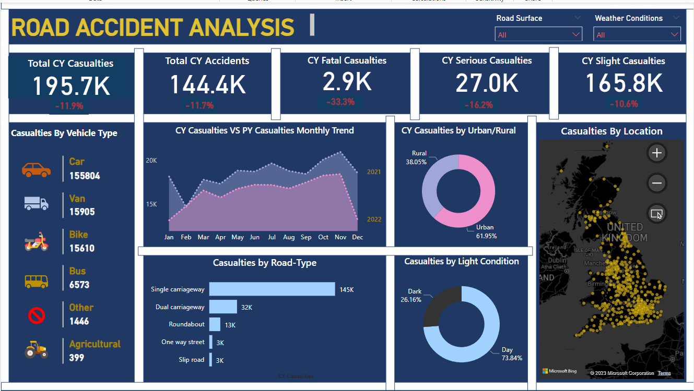

# Road-Accident-Analysis
The Road Accident Dashboard visually represents data on road accidents, offering a rapid snapshot of current road safety conditions in a specific region or country. The analysis focuses on identifying reduction strategies, evaluating total casualties, year-over-year growth, casualties by severity, vehicle types, and monthly trends. The data spans the years 2021 and 2022, providing valuable insights for informed decision-making in road safety initiatives.

## 📊Key Steps:
- Requirement Gathering
- Data Overview
- Data Cleaning & Processing
- Created a dynamic dashboard with various chart types including card, multi-row card, area chart, bar chart, donut chart, slicer, and map.

## 💡Insights:
- 👉 📉 Achieved an impressive 12% YoY reduction in casualties, indicating positive progress.

- 👉 Fatal casualties decreased by 33%, serious injuries by 16%, and slight injuries by 10%, reflecting overall safety improvement🚦.

- 👉 Cars🚗 were the primary contributors to accidents; implementing regulations for four-wheelers could reduce incidents.

- 👉 Identified contributions from both urban and rural areas to accidents, emphasizing the need for extra focus on urban areas.

- 👉 Accidents are more prevalent in daylight🌞, with some occurring in the dark..

- 👉 Single-carriageway or one-lane roads🛣️ account for 70-75% of accidents. Converting these to double lanes could be a strategic approach for reducing accidents.

